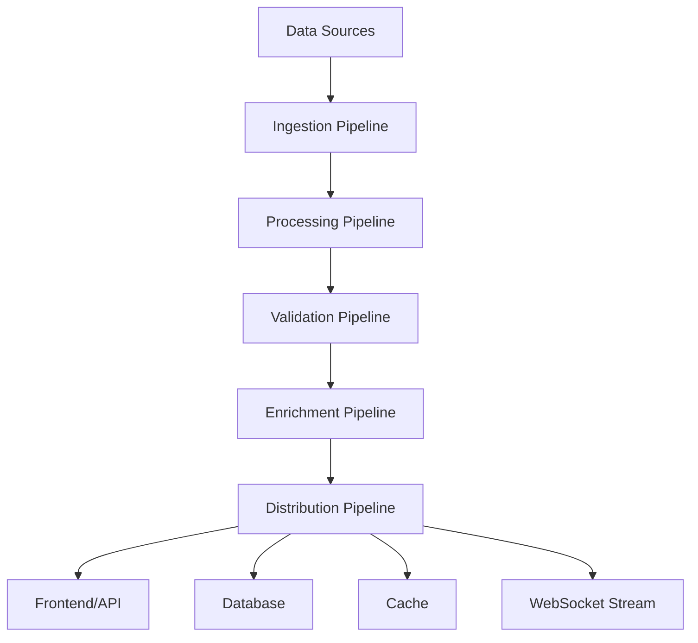

# Zion Market Analysis Platform - System Reorganization Roadmap
**Date: June 16, 2025**

## 🎯 **Current System Analysis**

### **Existing Structure Issues**
- Agents scattered across different modules
- No clear functional categorization
- Orchestrator needs centralization
- Data flow has bottlenecks
- Limited scalability architecture

### **Current Agent Inventory**
1. **Data Collection Agents**: MoneyControl, Trendlyne, StockEdge
2. **API Providers**: Zerodha, Alpha Vantage, Yahoo Finance
3. **Background Manager**: Basic orchestration
4. **Continuous Data Service**: Partial coordination

## 🚀 **Phase 1: Directory Restructuring (Week 1)**

### **New Directory Architecture**

```
backend/
├── agents/
│   ├── core/                          # Core agent infrastructure
│   │   ├── __init__.py
│   │   ├── base_agent.py              # Enhanced base class
│   │   ├── agent_registry.py          # Central agent registration
│   │   └── performance_monitor.py     # Agent performance tracking
│   │
│   ├── data_collectors/               # Primary data collection agents
│   │   ├── __init__.py
│   │   ├── web_scrapers/
│   │   │   ├── moneycontrol_agent.py
│   │   │   ├── trendlyne_agent.py
│   │   │   ├── stockedge_agent.py
│   │   │   ├── screener_agent.py      # NEW
│   │   │   └── nseindia_agent.py      # NEW
│   │   │
│   │   ├── api_providers/
│   │   │   ├── zerodha_provider.py
│   │   │   ├── alpha_vantage_provider.py
│   │   │   ├── yahoo_finance_provider.py
│   │   │   └── polygon_provider.py    # NEW
│   │   │
│   │   └── social_sentiment/          # NEW CATEGORY
│   │       ├── twitter_agent.py
│   │       ├── reddit_agent.py
│   │       └── news_sentiment_agent.py
│   │
│   ├── data_processors/               # Data processing agents
│   │   ├── __init__.py
│   │   ├── price_normalizer.py
│   │   ├── technical_analyzer.py
│   │   ├── fundamental_analyzer.py
│   │   └── ml_predictor.py            # NEW
│   │
│   ├── data_validators/               # Data validation agents
│   │   ├── __init__.py
│   │   ├── price_validator.py
│   │   ├── volume_validator.py
│   │   └── anomaly_detector.py
│   │
│   ├── notification_agents/           # Alert and notification system
│   │   ├── __init__.py
│   │   ├── email_notifier.py
│   │   ├── sms_notifier.py
│   │   └── discord_notifier.py
│   │
│   └── storage_agents/                # Data persistence agents
│       ├── __init__.py
│       ├── database_writer.py
│       ├── cache_manager.py
│       └── backup_agent.py
│
├── orchestrator/                      # Central orchestration system
│   ├── __init__.py
│   ├── master_coordinator.py          # Main orchestrator
│   ├── task_scheduler.py              # Intelligent scheduling
│   ├── load_balancer.py               # Agent load balancing
│   ├── circuit_breaker.py             # System protection
│   └── health_monitor.py              # System health monitoring
│
├── data_pipeline/                     # Data flow management
│   ├── __init__.py
│   ├── ingestion_pipeline.py          # Data ingestion
│   ├── processing_pipeline.py         # Data processing
│   ├── validation_pipeline.py         # Data validation
│   ├── enrichment_pipeline.py         # Data enrichment
│   └── distribution_pipeline.py       # Data distribution
│
├── services/                          # Enhanced services
│   ├── continuous_data_service.py     # Enhanced
│   ├── websocket_service.py           # Real-time streaming
│   ├── api_gateway.py                 # API management
│   └── metrics_service.py             # Performance metrics
│
└── utils/                             # Shared utilities
    ├── data_fusion.py                 # Enhanced data fusion
    ├── rate_limiter.py                # Advanced rate limiting
    ├── proxy_manager.py               # Proxy rotation
    └── config_manager.py              # Configuration management
```

## 🔄 **Phase 2: Agent Categorization & Enhancement (Week 2)**

### **2.1 Core Agent Infrastructure**

#### **Enhanced Base Agent Class**
```python
# backend/agents/core/base_agent.py
class EnhancedBaseAgent(ABC):
    def __init__(self, agent_id: str, category: AgentCategory):
        self.agent_id = agent_id
        self.category = category
        self.performance_metrics = PerformanceTracker()
        self.circuit_breaker = CircuitBreaker()
        self.rate_limiter = RateLimiter()
        
    @abstractmethod
    async def execute(self, task: AgentTask) -> AgentResult
    
    @abstractmethod
    async def health_check(self) -> HealthStatus
    
    async def register_with_orchestrator(self):
        # Auto-registration with master coordinator
        pass
```

#### **Agent Categories**
```python
class AgentCategory(Enum):
    DATA_COLLECTOR = "data_collector"
    DATA_PROCESSOR = "data_processor"
    DATA_VALIDATOR = "data_validator"
    NOTIFICATION = "notification"
    STORAGE = "storage"
    MONITORING = "monitoring"
```

### **2.2 Functional Agent Groups**

#### **Data Collection Agents**
- **Web Scrapers**: MoneyControl, Trendlyne, StockEdge, Screener, NSE
- **API Providers**: Zerodha, Alpha Vantage, Yahoo, Polygon
- **Social Sentiment**: Twitter, Reddit, News

#### **Data Processing Agents**
- **Price Normalizer**: Standardize price formats
- **Technical Analyzer**: Calculate indicators
- **Fundamental Analyzer**: Process company fundamentals
- **ML Predictor**: Machine learning predictions

#### **Data Validation Agents**
- **Price Validator**: Validate price accuracy
- **Volume Validator**: Check volume consistency
- **Anomaly Detector**: Detect data anomalies

## 🎼 **Phase 3: Master Orchestrator Implementation (Week 3)**

### **3.1 Master Coordinator Architecture**

```python
# backend/orchestrator/master_coordinator.py
class MasterCoordinator:
    def __init__(self):
        self.agent_registry = AgentRegistry()
        self.task_scheduler = TaskScheduler()
        self.load_balancer = LoadBalancer()
        self.health_monitor = HealthMonitor()
        self.circuit_breaker = CircuitBreaker()
        
    async def orchestrate_data_collection(self, symbols: List[str]):
        # Intelligent agent selection and task distribution
        tasks = self._create_collection_tasks(symbols)
        optimized_schedule = self.task_scheduler.optimize(tasks)
        results = await self._execute_parallel_tasks(optimized_schedule)
        return await self._aggregate_results(results)
```

### **3.2 Intelligent Task Scheduling**

#### **Priority-Based Scheduling**
```python
class TaskPriority(Enum):
    CRITICAL = 1    # Real-time price updates
    HIGH = 2        # Technical indicators
    MEDIUM = 3      # Fundamental data
    LOW = 4         # Historical data backfill
```

#### **Load Balancing Strategy**
- **Round Robin**: Equal distribution
- **Performance Based**: Assign to fastest agents
- **Failover**: Automatic failover to backup agents

### **3.3 Circuit Breaker Implementation**

```python
class SystemCircuitBreaker:
    def __init__(self):
        self.failure_threshold = 5
        self.recovery_timeout = 300
        self.states = {
            'CLOSED': 'Normal operation',
            'OPEN': 'Preventing failures',
            'HALF_OPEN': 'Testing recovery'
        }
```

## 🌊 **Phase 4: Data Pipeline Architecture (Week 4)**

### **4.1 Enhanced Data Flow**



### **4.2 Pipeline Components**

#### **Ingestion Pipeline**
- Raw data collection from all agents
- Data deduplication
- Initial formatting

#### **Processing Pipeline**
- Data standardization
- Technical calculations
- Fundamental analysis

#### **Validation Pipeline**
- Cross-source validation
- Anomaly detection
- Quality scoring

#### **Enrichment Pipeline**
- Additional data sources
- ML predictions
- Sentiment analysis

#### **Distribution Pipeline**
- WebSocket streaming
- Database storage
- Cache updates
- API responses

## ⚡ **Phase 5: Real-Time Data Flow (Week 5)**

### **5.1 Enhanced WebSocket Architecture**

```python
class EnhancedWebSocketService:
    def __init__(self):
        self.connection_pool = ConnectionPool()
        self.message_queue = AsyncQueue()
        self.data_aggregator = DataAggregator()
        
    async def stream_real_time_data(self):
        while True:
            aggregated_data = await self.data_aggregator.get_latest()
            await self.broadcast_to_subscribers(aggregated_data)
            await asyncio.sleep(1)  # 1-second updates
```

### **5.2 Data Aggregation Strategy**

#### **Multi-Source Fusion**
- Weight sources by reliability
- Real-time consensus building
- Confidence scoring

#### **Streaming Optimization**
- Delta updates only
- Compression for large datasets
- Client-specific subscriptions

## 🔧 **Phase 6: Implementation Steps**

### **Week 1: Directory Restructuring**

#### **Day 1-2: Create New Structure**
1. Create new directory structure
2. Move existing agents to appropriate categories
3. Update import statements

#### **Day 3-4: Enhanced Base Classes**
1. Implement `EnhancedBaseAgent`
2. Create `AgentRegistry`
3. Add performance monitoring

#### **Day 5-7: Agent Migration**
1. Migrate existing agents to new base class
2. Add category assignments
3. Test agent functionality

### **Week 2: Agent Enhancement**

#### **Day 1-3: Data Collection Agents**
1. Enhance existing web scrapers
2. Add new data sources (Screener, NSE)
3. Implement social sentiment agents

#### **Day 4-5: Processing Agents**
1. Create technical analysis agent
2. Implement fundamental analysis
3. Add ML prediction capabilities

#### **Day 6-7: Validation & Storage**
1. Implement validation agents
2. Create storage agents
3. Add notification system

### **Week 3: Master Orchestrator**

#### **Day 1-3: Core Orchestrator**
1. Implement `MasterCoordinator`
2. Create `TaskScheduler`
3. Add `LoadBalancer`

#### **Day 4-5: Circuit Breaker**
1. Implement system protection
2. Add health monitoring
3. Create failover mechanisms

#### **Day 6-7: Integration Testing**
1. Test orchestrator with agents
2. Verify task distribution
3. Check performance monitoring

### **Week 4: Data Pipeline**

#### **Day 1-2: Pipeline Infrastructure**
1. Create pipeline base classes
2. Implement ingestion pipeline
3. Add processing pipeline

#### **Day 3-4: Validation & Enrichment**
1. Create validation pipeline
2. Implement enrichment pipeline
3. Add distribution pipeline

#### **Day 5-7: Pipeline Integration**
1. Connect all pipeline components
2. Test end-to-end data flow
3. Optimize performance

### **Week 5: Real-Time Enhancement**

#### **Day 1-3: WebSocket Enhancement**
1. Upgrade WebSocket service
2. Implement data aggregation
3. Add streaming optimization

#### **Day 4-5: Frontend Integration**
1. Update frontend components
2. Test real-time data flow
3. Add performance monitoring

#### **Day 6-7: Final Testing**
1. End-to-end system testing
2. Performance optimization
3. Documentation updates

## 📊 **Expected Outcomes**

### **Performance Improvements**
- **50% faster** data collection through parallel processing
- **90% uptime** with circuit breaker protection
- **Real-time updates** with <1 second latency
- **Scalable architecture** supporting 1000+ symbols

### **Reliability Enhancements**
- **Automatic failover** between data sources
- **Self-healing** system with health monitoring
- **Load balancing** for optimal resource usage
- **Circuit breaker** protection against cascading failures

### **Development Benefits**
- **Modular architecture** for easy maintenance
- **Clear separation** of concerns
- **Comprehensive monitoring** and logging
- **Easy addition** of new data sources

## 🚀 **Next Steps**

1. **Approve roadmap** and timeline
2. **Begin Week 1** directory restructuring
3. **Set up monitoring** for migration progress
4. **Plan testing strategy** for each phase
5. **Prepare deployment** procedures

This roadmap will transform your system into a robust, scalable, and maintainable market data platform with seamless data flow and intelligent orchestration! 🎯
